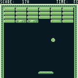

Wasmanoid
====

An Arkanoid clone for WASM-4 fantasy console

This game developed for the first [WASM-4 game jam] on January 2022

<https://git.claudiomattera.it/wasm4fun/wasmanoid/>

Implementation
----

This game is implemented in [Rust] for the fantasy console [WASM-4].

It can be run directly with the following commands.

~~~~bash
cargo build --release
w4 run-native target/wasm32-unknown-unknown/release/cartridge.wasm
~~~~

In alternative, it can be embedded in a web page using [WebAssembly].
A standalone cartridge (i.e. a self-contained HTML file) can be generated with the following commands.

~~~~bash
cargo build --release
w4 bundle target/wasm32-unknown-unknown/release/cartridge.wasm
    --title "Wasmanoid"
    --description "An Arkanoid clone for WASM-4 fantasy console"
    --timestamp
    --html ./cartridge.html
~~~~

[Rust]: https://www.rust-lang.org/
[WASM-4]: https://wasm4.org/
[WebAssembly]: https://webassembly.org/
[WASM-4 game jam]: https://itch.io/jam/wasm4

License
----

Copyright Claudio Mattera 2022

You are free to copy, modify, and distribute this application with attribution under the terms of the [MPL 2.0 license]. See the [`License.txt`](./License.txt) file for details.

[MPL 2.0 license]: https://opensource.org/licenses/MPL-2.0
